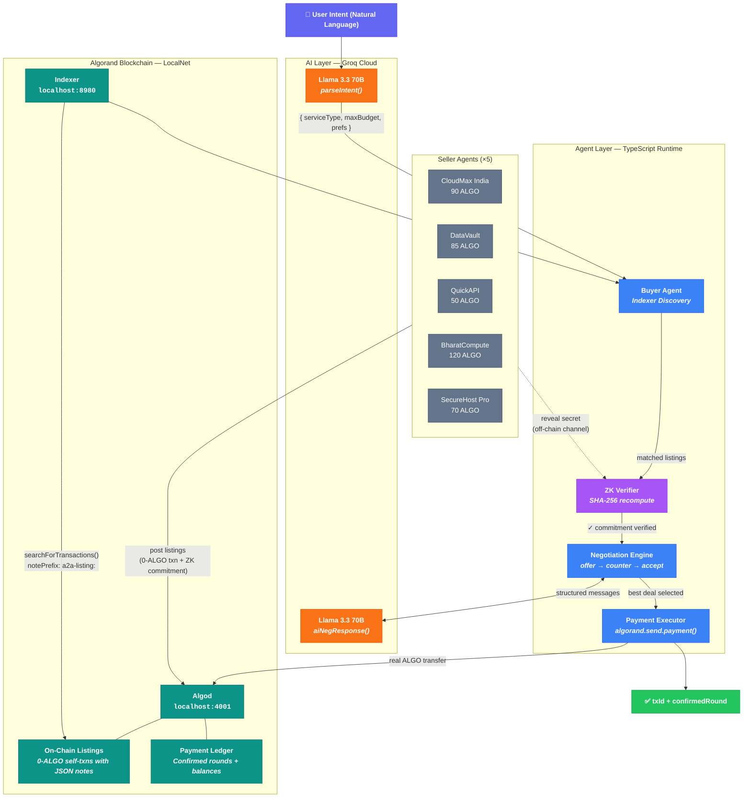
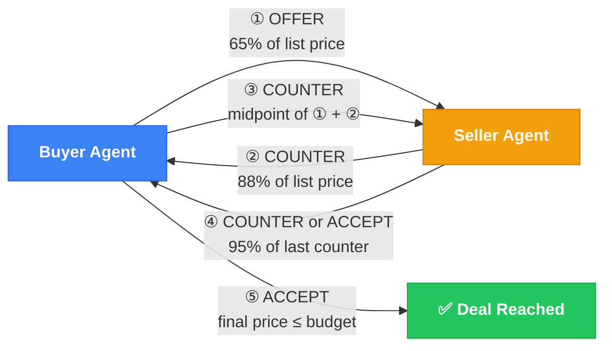
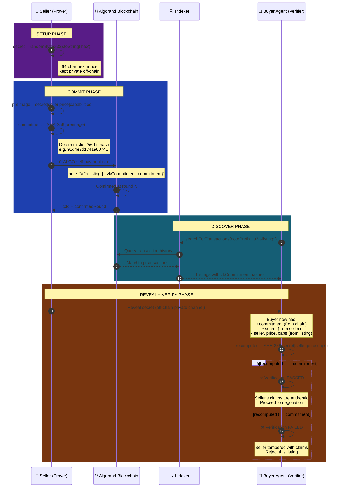

<p align="center">
  
  
  
  
  
</p>

<h1 align="center">A2A Agentic Commerce Framework</h1>

<p align="center">
  <strong>Autonomous AI agents that discover, negotiate, and transact — on the Algorand blockchain.</strong>
</p>

<p align="center">
  On-chain listings &nbsp;·&nbsp; Indexer discovery &nbsp;·&nbsp; SHA-256 ZK commitments &nbsp;·&nbsp; AI negotiation &nbsp;·&nbsp; Real payments
</p>

---

## The Problem

Today's digital commerce is fundamentally human-bottlenecked. Every purchase — from cloud storage to API access — requires a person to search, compare, negotiate, and pay. As services become increasingly commoditized and agent-driven workflows emerge, there's no infrastructure for **machines to autonomously transact with each other** on a trust-minimized, verifiable layer.

**A2A Agentic Commerce** solves this by creating an end-to-end pipeline where AI agents:

1. **Discover** services listed directly on the Algorand blockchain
2. **Verify** seller authenticity via cryptographic commitment schemes
3. **Negotiate** pricing using LLM-powered intelligence
4. **Execute** real payments — all without human intervention

> Built for the Indian market context: SME procurement automation where an agent can autonomously find and purchase the cheapest cloud storage, API gateway, or GPU compute instance.

---

## Key Features

- **Real On-Chain Listings** — Sellers publish service listings as 0-ALGO self-transactions with structured JSON in the note field. Every listing is a confirmed transaction with a verifiable `txId` and round number.

- **Algorand Indexer Discovery** — Buyer agents query the Indexer by `notePrefix` to discover listings directly from the blockchain. No off-chain databases or registries.

- **SHA-256 ZK Commitment Scheme** — Sellers generate a cryptographic commitment (`SHA-256(secret|seller|price|capabilities)`) published on-chain. Buyers verify claims by recomputing the hash against the revealed secret — providing **binding** (seller can't alter claims post-commit) and **hiding** (on-chain data reveals nothing without the secret).

- **AI-Powered Intent Parsing** — Natural language purchase requests are parsed by Groq's Llama 3.3 70B into structured intent objects (service type, budget, preferences).

- **Multi-Round Negotiation** — Agents exchange structured `offer → counter → accept` messages with AI-generated natural language responses. 1–2 round protocol with concession logic.

- **Real ALGO Payments** — After agreement, the buyer agent executes a real payment transaction on Algorand LocalNet. Returns confirmed `txId`, round, and updated balances.

- **Beautiful Terminal UI** — Rich formatted output with color-coded negotiation bubbles, progress sections, and a final transaction receipt.

---

## System Architecture



### Tech Stack

| Layer | Technology | Purpose |
|:------|:-----------|:--------|
| **Blockchain** | Algorand LocalNet | On-chain listings, payment execution |
| **SDK** | `algosdk` v3.2 + `algokit-utils` v8.2 | Account management, transactions, Indexer queries |
| **AI / LLM** | Groq (Llama 3.3 70B Versatile) | Intent parsing, seller negotiation responses |
| **Cryptography** | Node.js `crypto` (SHA-256) | ZK commitment scheme (create + verify) |
| **Runtime** | `tsx` (TypeScript Execute) | Direct TS execution without compilation |
| **Frontend** | Next.js 15, React 19, Tailwind CSS 4 | Web dashboard (available for future integration) |
| **Language** | TypeScript 5.8 (strict mode) | End-to-end type safety |

### Project Structure

```
a2a-commerce/
├── scripts/
│   └── run.ts                  # Main terminal runner (full pipeline)
├── src/
│   ├── app/
│   │   ├── page.tsx            # Next.js frontend dashboard
│   │   ├── layout.tsx          # Root layout
│   │   └── api/                # API routes (init, discover, negotiate, execute)
│   ├── components/             # React components (listings, negotiation, tx status)
│   └── lib/
│       ├── agents/             # Buyer/seller agent logic + types
│       ├── ai/                 # Groq LLM integration
│       ├── a2a/                # Structured messaging protocol
│       ├── blockchain/         # Algorand client, listings, ZK proofs
│       └── negotiation/        # Multi-round negotiation engine
├── package.json
├── tsconfig.json
└── .env                        # GROQ_API_KEY
```

---

## Installation & Setup

### Prerequisites

| Requirement | Version | Installation |
|:------------|:--------|:-------------|
| Node.js | 18+ | [nodejs.org](https://nodejs.org) |
| AlgoKit CLI | latest | `pipx install algokit` |
| Docker | latest | Required by AlgoKit LocalNet |

### 1. Clone & Install

```bash
git clone <repo-url> && cd a2a-commerce
npm install
```

### 2. Configure Environment

Create a `.env` file in the project root:

```env
GROQ_API_KEY=your_groq_api_key_here
```

> Get a free API key at [console.groq.com](https://console.groq.com)

### 3. Start Algorand LocalNet

```bash
algokit localnet start
```

This spins up a local Algorand node (Algod on `localhost:4001`) and Indexer (`localhost:8980`) via Docker.

### 4. Run

```bash
npx tsx scripts/run.ts "Buy cloud storage under 100 ALGO"
```

Or use the npm script:

```bash
npm run a2a -- "Buy cloud storage under 100 ALGO"
```

---

## Usage

Pass any natural language purchase intent as an argument:

```bash
# Cloud storage
npx tsx scripts/run.ts "Buy cloud storage under 100 ALGO"

# API access
npx tsx scripts/run.ts "Find API gateway service under 60 ALGO"

# GPU compute
npx tsx scripts/run.ts "I need GPU compute for ML training, budget 150 ALGO"

# Web hosting
npx tsx scripts/run.ts "Get managed hosting for my startup, budget 80 ALGO"
```

### Negotiation Protocol



> Each message is a structured `X402Msg` with `from`, `to`, `action`, `price`, and AI-generated `text`. Seller responses are produced by Groq Llama 3.3 70B for natural language flavor.

### Pipeline Stages

The framework executes **8 stages** sequentially:

| # | Stage | What Happens |
|:--|:------|:-------------|
| 1 | **Connect** | Connects to Algorand LocalNet, verifies node status |
| 2 | **Fund Accounts** | Creates 1 buyer (5,000 ALGO) and 5 seller accounts (100 ALGO each) |
| 3 | **Post Listings** | Each seller publishes a 0-ALGO self-txn with JSON note + SHA-256 commitment |
| 4 | **Parse Intent** | Groq LLM extracts `serviceType`, `maxBudget`, and `preferences` from natural language |
| 5 | **Indexer Discovery** | Queries Algorand Indexer by `notePrefix`, parses JSON, filters by intent |
| 6 | **ZK Verify + Negotiate** | Verifies seller commitments, then runs AI-powered offer/counter/accept rounds |
| 7 | **Select Best Deal** | Picks the cheapest accepted deal across all negotiations |
| 8 | **Execute Payment** | Sends real ALGO from buyer to seller, returns `txId` + confirmed round |

### Example Output

```
  A2A AGENTIC COMMERCE FRAMEWORK
  On-chain listings · Indexer discovery · SHA-256 ZK · Real payments
────────────────────────────────────────────────────────────────

▸ Connecting to Algorand LocalNet
  ✓ Connected — Last round: 88

▸ Fetching listings from Indexer
  ✓ Parsed 5 listings from Indexer (rounds 95–99)

▸ Found 2/5 matching listings from Indexer
  • cloudmax         "Enterprise Cloud Storage"  90 ALGO
  • datavault        "SME Cloud Storage"         85 ALGO

  Negotiating with datavault  (SME Cloud Storage, 85 ALGO)
  ✓ SHA-256 verification: recomputed hash MATCHES on-chain commitment
  Buyer Agent    [OFFER]   55 ALGO
  datavault      [COUNTER] 75 ALGO
  Buyer Agent    [COUNTER] 65 ALGO
  datavault      [COUNTER] 71 ALGO
  Buyer Agent    [ACCEPT]  71 ALGO
  Result: ✓ DEAL at 71 ALGO (saved 16%)

  ✓ Payment confirmed on-chain!
  TX ID: REWVGODJ7EB4QZX6HJOFQWQVOMNICLV2QKMZECSEQ35POSLYCDEQ
  Confirmed Round: 100

  ┌─────────────────────────────────────────────────────────┐
  │  Service:    SME Cloud Storage                          │
  │  Seller:     datavault                                  │
  │  Price:      71 ALGO                                    │
  │  Savings:    16%                                        │
  │  ZK (SHA256): Verified ✓                                │
  └─────────────────────────────────────────────────────────┘
```

---

## On-Chain Data Format

Every listing is stored in a payment transaction's `note` field:

```
a2a-listing:{"type":"cloud-storage","service":"Enterprise Cloud Storage","price":90,"seller":"cloudmax","description":"Enterprise-grade, Mumbai & Chennai DC, 99.99% uptime","timestamp":1742565600000,"zkCommitment":"91d4e7d1741a8074b9b366fc25b893c4..."}
```

| Field | Type | Description |
|:------|:-----|:------------|
| `type` | `string` | Service category (`cloud-storage`, `api-access`, `compute`, `hosting`) |
| `service` | `string` | Human-readable service name |
| `price` | `number` | Listed price in ALGO |
| `seller` | `string` | Seller identifier |
| `description` | `string` | Service capabilities |
| `timestamp` | `number` | Unix timestamp of listing creation |
| `zkCommitment` | `string` | SHA-256 commitment hash for claim verification |

---

## ZK Commitment Scheme

The framework implements a hash-based cryptographic commitment scheme for seller verification, executed across three distinct phases:



### Cryptographic Properties

| Property | Guarantee | How It Works |
|:---------|:----------|:-------------|
| **Binding** | Seller cannot change claims after committing | SHA-256 is collision-resistant — finding a different preimage that produces the same hash is computationally infeasible (2¹²⁸ operations) |
| **Hiding** | On-chain commitment reveals nothing without the secret | The 32-byte random nonce ensures the hash is uniformly distributed regardless of the input data. Without `secret`, the commitment is indistinguishable from random |
| **Integrity** | Buyer can detect any tampering | If the seller modifies price, capabilities, or any claim after committing, the recomputed hash will not match the on-chain commitment |

---

## Available Sellers (Indian Market)

| Seller | Service | Type | Price | Location |
|:-------|:--------|:-----|:------|:---------|
| CloudMax India | Enterprise Cloud Storage | `cloud-storage` | 90 ALGO | Mumbai & Chennai DC |
| DataVault | SME Cloud Storage | `cloud-storage` | 85 ALGO | Hyderabad |
| QuickAPI | API Gateway Pro | `api-access` | 50 ALGO | — |
| BharatCompute | GPU Compute Instances | `compute` | 120 ALGO | Pune (NVIDIA A100) |
| SecureHost Pro | Managed Hosting | `hosting` | 70 ALGO | Indian CDN |

---

## Roadmap

- [x] On-chain listings via 0-ALGO transactions
- [x] Algorand Indexer-based discovery
- [x] SHA-256 ZK commitment scheme
- [x] AI-powered intent parsing (Groq Llama 3.3 70B)
- [x] Multi-round negotiation with AI responses
- [x] Real ALGO payment execution on LocalNet
- [x] Rich terminal UI with formatted output
- [ ] x402 protocol integration (TestNet — USDC payments with fee abstraction)
- [ ] Next.js frontend dashboard
- [ ] Multi-agent parallel negotiation
- [ ] Seller reputation scoring
- [ ] TestNet / MainNet deployment

---

<p align="center">
  <sub>Built on <strong>Algorand</strong> — fast finality, low fees, carbon negative.</sub>
</p>
